# Ejercicio práctico

El primer paso vamos a crear un repositorio con el nombre “ejercicio_git_nombre_alumno”.

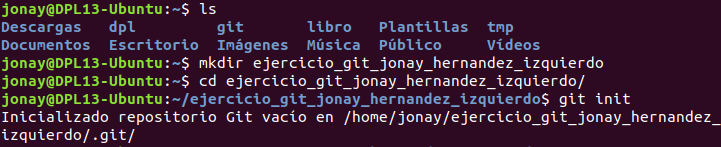

El siguiente paso es crear un “README.md” básico.

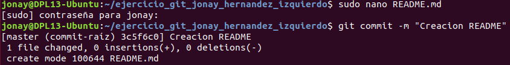

Ahora vamos a crear un ramas nueva llamada “feature-1”.

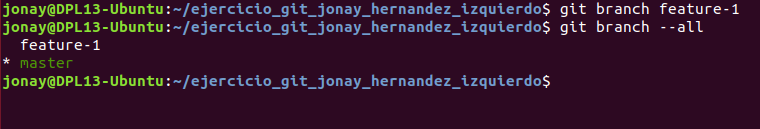

Nos desplazamos a esta rama y vamos a crear el fichero “hola.html con la información siguiente”.

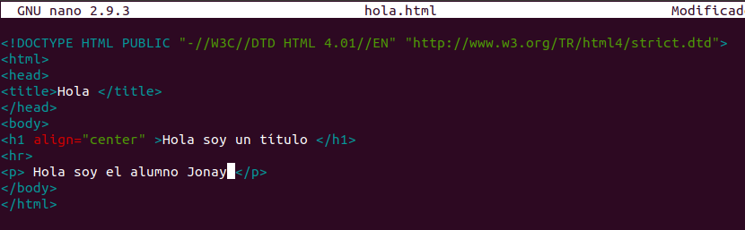

Aquí vamos a almacenar los cambios en la zona de intercambio temporal y realizar un commit.

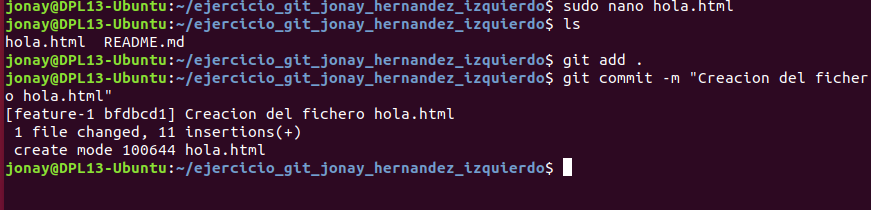

Con esto realizado vamos a cambiarnos a la rama “master” y crear un fichero “adios.html” con la información pertinente.
Primero nos cambiamos de rama.

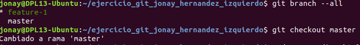

Creamos el fichero.

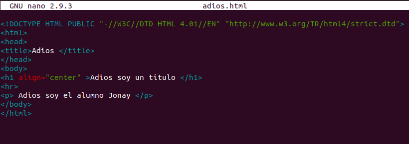

Y ahora como antes guardamos los cambios y realizamos el commit.

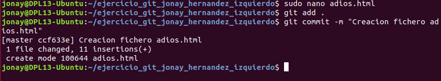

En este paso vamos a realizar una mesclar con los repositorios.

Realizamos el merge y escribimos el commit de la fusión.

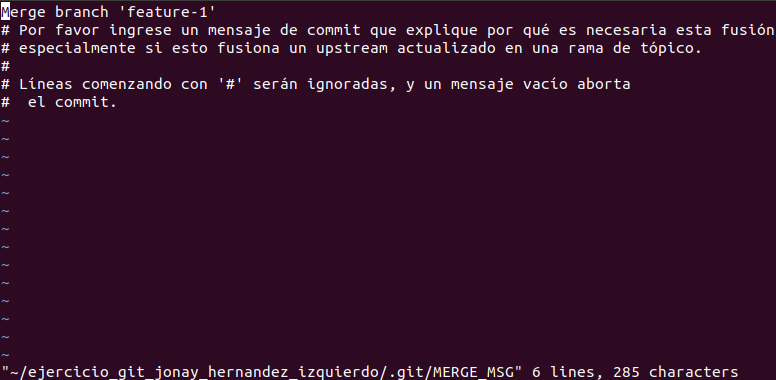

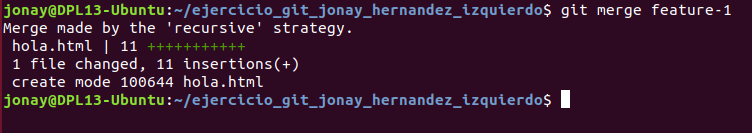

El ls para comprobar si los archivos están.

Y realizamos la comprobación de todos los cambios realizados.

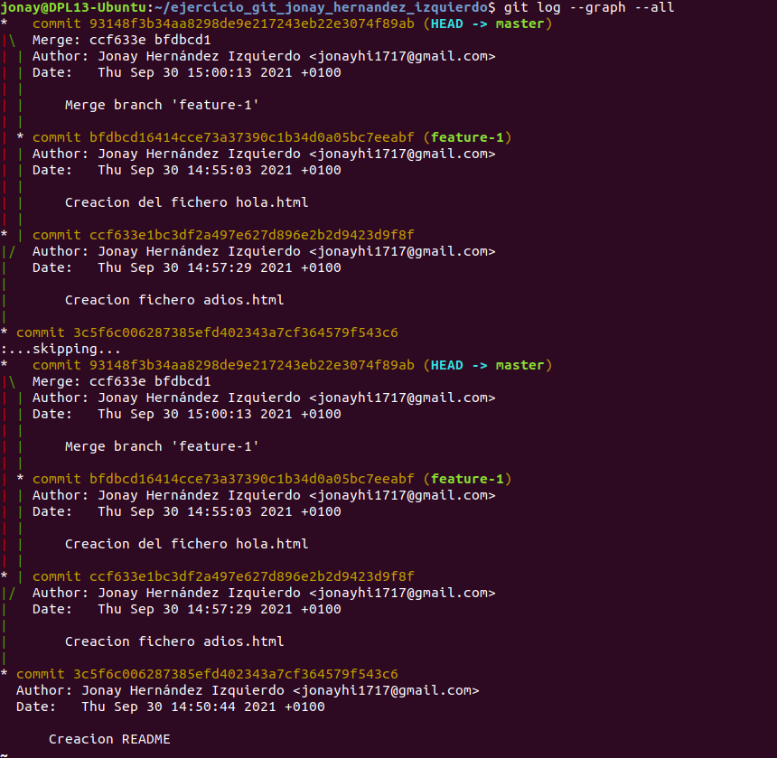
