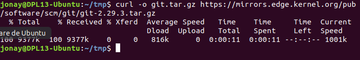
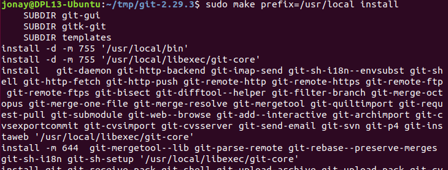
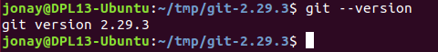
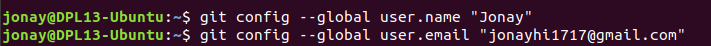

# Tarea01 - Instalación y configuración de Git

# 1. Instalación de Git
# 1.1 Instalación por defecto de Git
En este ejemplo vamos a ver una instalación de Git en en sistema Linux, concretamente en un Ubuntu 18. Git es un sistema de control de versiones que nos permite a los desarrolladores crear nuestras aplicaciones, subirlas,  editarla, volver a una versión anterior, crear ramas, mesclar estas, entre otras características.

Para empezar con la instalación de Git primero comprobaremos si en nuestro sistema ya esta instalado Git.

```
git --version
```

En caso de no tener instalado Git debería salir un mensaje como el siguiente.


Vamos a instalar Git por defecto en Ubuntu, para ello primero vamos a actualizar los paquetes de los repositorios de Ubuntu.

```
sudo apt update
```

Debería salir algo como esto.


Con esto procedemos a instalar git con el siguiente comando

```
sudo apt install git
```


Vamos a realizar el comando para comprobar la versión de Git que tenemos instalada.

```
git --version
```
Como vemos en la siguiente captura se nos ha instalado Git con la versión 2.29.3.


## 1.2 Instalar versión especifica de Git.

Antes hemos visto como instalar Git, pero que ocurre si queremos una versión superior o inferior. En ese caso mas a explicar como instalar una versión en concreto de Git.

Primero de todo actualizamos los paquetes de nuestra maquina y instalar una serie de paquetes nuevos.

```
sudo apt install libz-dev libssl-dev libcurl4-gnutls-dev libexpat1-dev gettext cmake gcc
 
```


Ahora vamos a descargar el paquete con la versión de Git, pero primero vamos a usar una carpeta temporal __/tmp__ en donde se almacenara.

```
curl -o git.tar.gz https://mirrors.edge.kernel.org/pub/software/scm/git/git-2.29.3.tar.gz

```



Descomprimimos la carpeta.

```
tar -zxf git.tar.gz
```

Lo deberíamos ver de la siguiente manera.


Teniendo todo descargado vamos a instalar Git, primero lanzaremos para crear el paquete y luego con el siguiente lo instalaremos. **Muy importante estar dentro de la carpeta descomprimida para lanzar estos comando.**

Comando para crear el paquete.
```
make prefix=/usr/local all

```

Comando para instalar el paquete.
```
sudo make prefix=/usr/local install
```

Ejemplo del primero comando.


Ejemplo del segundo comando.



El siguiente paso es ejecutar el comando en la __bash__ para reemplaza el proceso y permitir usar la versión que hemos instalado.

```
exec bash
``` 


Como hicimos anteriormente vamos a comprobar si la versión de Git esta instalada correctamente.



Como vemos nos aparece la versión que acabamos de instalar, con que ya tenemos Git instalado en nuestro sistema Ubuntu.

# 2. Configuración de Git

Puesto que ya tenemos instalado Git en nuestro sistema podríamos configurar lo para que cada vez que compile y genere contenga información correcta del usuario. 

Esta información se nos solicitara al realizar el comando __git config__ en donde podremos declarar nuestro nombre y correo electrónico.

Comando para añadir nuestro nombre
```
git config --global user.name "Nombre"
```

Comando para añadir nuestro correo electrónico
```
git config --global user.email "correo@dominio.com"
```




Podemos ver la lista de la configuración de Git con:

```
git config --list
```


Todo esta información que acabamos de registrar se guarda en una fichero de configuración. Lo podemos abrir y editar en cualquier momento si es necesario.


Con esto tendremos la configuración mas básica e Git realizada.
