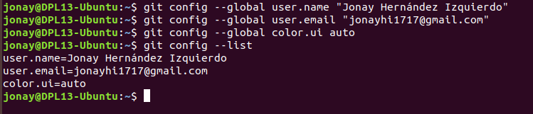
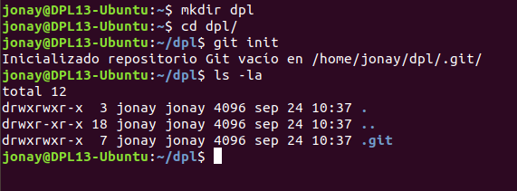
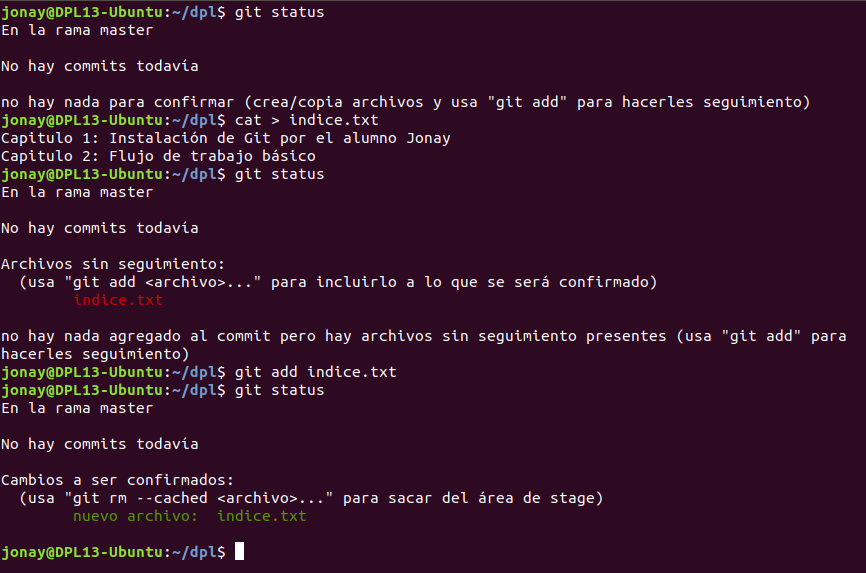
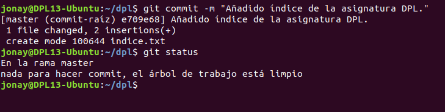
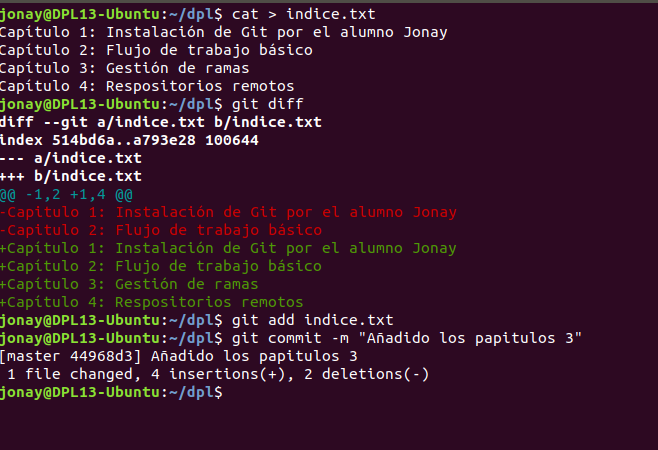
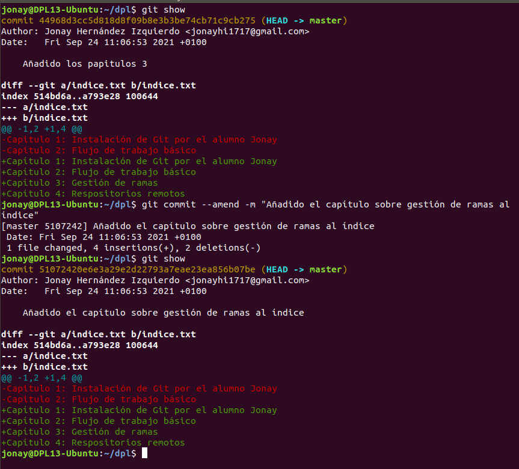

# Tarea02 - Manipular Repositorios en Git

En esta tarea se va ver como realizar las creación, manipulación de un repositorio de Git. Para esto vamos a definir unos puntos donde se mostrar como trabajar.


# 1. Configuración.

En la configuración se puede definir el nombre de usuario, el correo y modificar el color de salida. Par manipular esta configuración vamos a usar el siguiente comando.

Para cambiar el nombre:
```
  git config --global user.name "nombre"
```

Para cambiar el correo:
```
git config --global user.email "correo"
```

Para cambiar el color de salida:
```
  git config --global color.ui auto
```

Y vamos a ver una imagen de ejemplo del uso de estos comando.



# 2. Creación de un repositorio.

Vamos a crear un repositorio usando Git y mostrar su información.

El comando para crear un repositorio de git es:

```
git init
```

Vamos a crear la carpeta, en este caso dpl, y crear el repositorio con el comando anterior.



# 3. Ver el estado de un repositorio.

Vamos a comprobar el estado del repositorio que acabamos de crear, luego crearemos un fichero en la misma carpeta. Con esto creado vamos a añadir el fichero a la zona de intercambio temporal de Git y luego volveremos a comprobar el estado del repositorio.

El comando para ver el estado es:
```
 git status
```

Y el comando para añadir el fichero:
```
git add fichero.txt
```

Veamos como comprobar y añadir un repositorio.



# 4. Realizar Commit`s
Los commit en Git son como una instantánea de como se encuentra tu proyecto en ese momento. Luego podemos añadir los cambios y almacenarlos en local o subirlo a la nube. Esta es una herramienta muy poderosa que nos facilita volver a commit anteriores en caso de error o consultar que cambios se han realizado de un commit a otro. El commit siempre se puede añadir una descripción que te permita resumir que cambios se han realizado.

Para realizar un commit en git usaremos el siguiente comando:

```
gir commit -m "Descripción del commit."
```

Ahora vamos ver un ejemplo de creación de commit y comprobación con el comando visto anteriormente.



# 5. Modificar un fichero.

Con lo que ya hemos visto vamos a añadir nuevos cambios en el fichero y a usar un comando para comprobar los cambios que se han realizado con respecto a la ultima versión guardada.

Para ello primero vamos a modificar el fichero, luego consultaremos los cambios, almacenaremos los cambios en local y finalmente realizaremos el nuevo commit.

El comando para consultar los cambios es:

```
git diff
```



# 6. Historial

Vamos a ver un comando que nos permite mostrar los cambios de la ultima vesión con respecto a la anterior. 

El comando para mostrar los cambios.
```
git show
```

Vamos a ver un ejemplo viendo los cambios, cambiamos el mensaje que definimos en el ultimo commit y volvemos a consultarlo.


