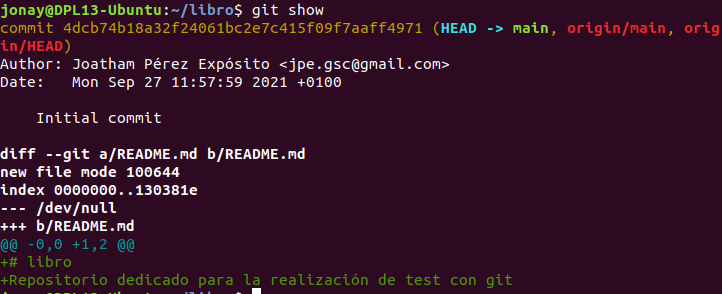
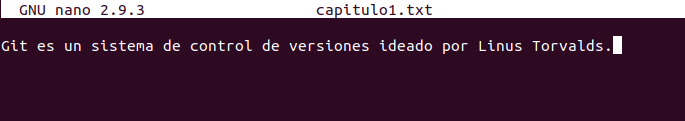
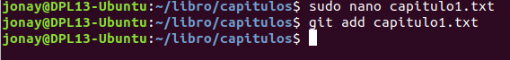
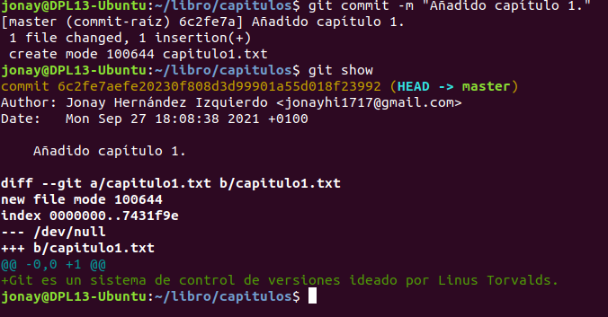
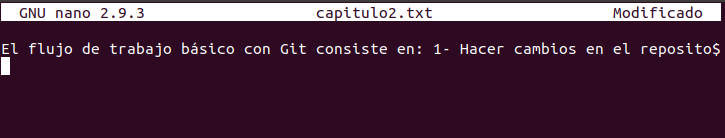
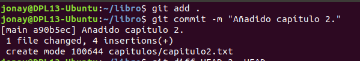
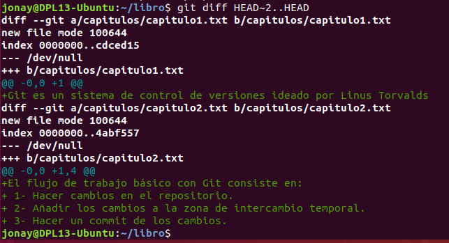
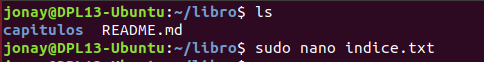
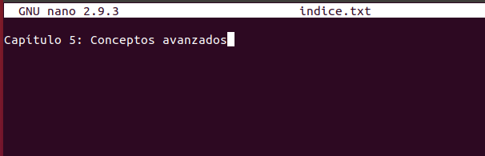
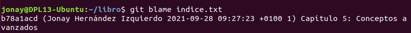

# Tarea03 - Manipulación Avanzada de repositorios en Git.

Vamos a realizar una serie de ejercicios que tiene como objetivo aprender el uso de comandos avanzados de git que nos permitirán trabajar en nuestros proyectos con esta poderosa herramienta.

## Ejercicio 1.

El primero consiste en crear una carpeta __capitulos__ , iniciarla como repositorio y realizar los siguientes pasos:

* Crear el fichero __capitulo1.txt__ con el texto siguiente.

```
Git es un sistema de control de versiones ideado por Linus Torvalds.
```
* Guardar los cambios y realizar un commit con el mensaje pertinente.

* Ver los cambios que se han realizado con el comando para ver el historial.

__SOLUCIÓN__

Crear una carpeta __capitulos__ e iniciar el repositorio.


Ver los cambios del repositorio.



Crear un fichero capitulo1.txt y guadar los cambios.







Crear un commit y volver a ver los cambios del repositorio




## Ejercicio 2.

En este vamos a realizar los pasos como en el anterior:

* Creamos el fichero __capitulo2.txt__ con la siguiente información.

```
El flujo de trabajo básico con Git consiste en: 
1- Hacer cambios en el repositorio. 
2- Añadir los cambios a la zona de intercambio temporal. 
3- Hacer un commit de los cambios.

```

* Luego guardamos y realizamos el commit pertinente.

* Ahora vamos a ver las diferencias de los cambios entre la ultima y las dos anteriores versiones.

__SOLUCIÓN__

Crear el fichero "capitulo2.txt".



Añadir y realizar un commit los nuevos cambios.



Ver la diferencias de la ultima con las 2 anteriores versiones del repositorio.



## Ejercicio 3.

Lo mismo de antes pero con __capitulo3.txt__, con el siguiente mensaje.

```
Git permite la creación de ramas lo que permite tener distintas versiones del mismo proyecto y trabajar de manera simultanea en ellas.

```

* Al terminar lo anterior, obtener los cambios de la primera y la ultima versión.

__SOLUCIÓN__

Crear el fichero “capitulo3.txt” e introducir la siguiente información.


Añadir los cambios y realizar el commit con el siguiente mensaje.


Comprobar los cambios entre la primera y la ultima versión.


## Ejercicio 4.

Ahora vamos aV crear el fichero __indice.txt__ y le añadimos la siguiente información.

```
Indice de los capítulos, con conceptos avanzados de git
```

* Como antes guardar los cambios y realizar el commit.

* Ver quien a realizado modificaciones en el fichero que acabamos de crear.

__SOLUCIÓN__

Crear y añadir información al fichero.





Guardar los cambios y realizar el commit.


Ver quien a realizado cambios en el fichero.




## Ejercicio 5.

* Vamos a crear una rama _bibliografia_ .
* ver todas las ramas del repositorio.

__SOLUCIÓN__

Crear y mostrar ramas


## Ejercicio 6.

Creamos el archivo __capitulo4.txt__ dentro de __capitulos__ y introducimos la siguiente información:

```
  En este capítulo veremos cómo usar GitHub para alojar repositorios en remoto.

```
* Guardamos los cambios y realizamos el commit.

* Ver el historial con las ramas.

__SOLUCIÓN__

Crear el fichero.


Añadir los cambios a la zona de intercambio temporal.


Realizar el commit.


Ver la información de cambios y las ramas.


## Ejercicio 7.

* Nos movemos a la rama __bibliografia__.

* Crear un nuevo fichero con el nombre __bibliografia.txt__ y con la siguiente información:

```
Chacon, S. and Straub, B. Pro Git. Apress.

```

* Guardamos los cambios y realizamos el commit.

* Ver el historial con las ramas.

__SOLUCIÓN__

Cambiar de rama.


Crear el fichero.


Crear el commit.


Ver toda la información con las ramas.


## Ejercicio 8.

* Unimos las ramas __bibliografia__ con la rama principal.

* Ver todos los cambios de todas las ramas.

* Borramos __bibliografia__.

* Volvemos a mostrar los cambios de todas las ramas.

__SOLUCIÓN__

Fusionamos las ramas.


Vemos los cambios con las ramas


Borramos la rama __bibliografia__.


Volvemos a consultar los cambios.


## Ejercicio 9.

* Volvemos a crear la rama __blibliografia__, Y nos desplazamos hacia ella.

* Volvemos a crear el fichero __bibliografia.txt__ con la siguiente información.

```
Scott Chacon and Ben Straub. Pro Git. Apress.
Ryan Hodson. Ry’s Git Tutorial. Smashwords (2014)
```
* Guardamos los cambios y realizamos el commit.

* Nos movemos a la rama principal.

* Modificamos el fichero __bibliografia.txt__ de la rama principal con el siguiente texto:
```
Chacon, S. and Straub, B. Pro Git. Apress.
Loeliger, J. and McCullough, M. Version control with Git. O’Reilly.

```

* Guardamos los cambios y realizamos el commit.

* Ahora intentamos fusionar las ramas al igual que antes.

* Resolver el conflicto entre las ramas seleccionando los cambios de la rama principal.

* Guardar los cambios y realizar el commit con el siguiente mensaje "Resuelto conflicto de bibliografia.".

* Ver los cambios junto con las ramas.

__SOLUCIÓN__

Crear y cambiar de rama.


Crear el fichero.


Cambiar a la rama principal.


Modificar el fichero.


Guardar los cambios y realizar el commit.


Fusionar las ramas.


Resolver el conflicto del merge.


Guardas los cambios y realizar el commit del conflicto resuelto.


Ver los cambios junto con las ramas.


