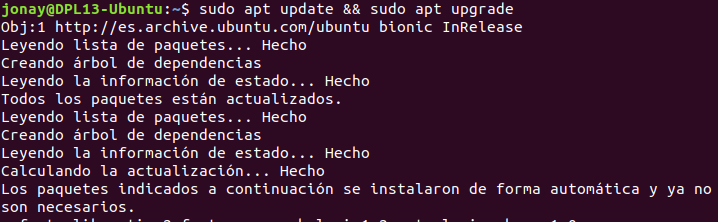
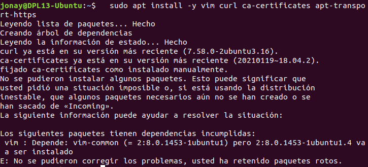
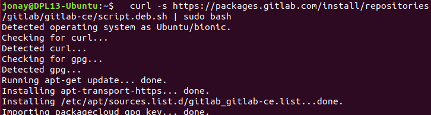
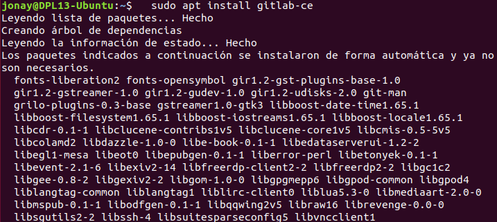
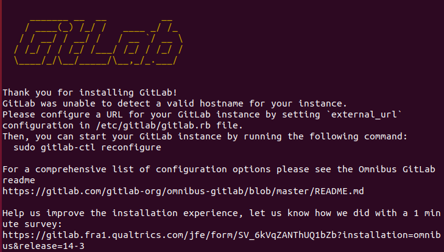
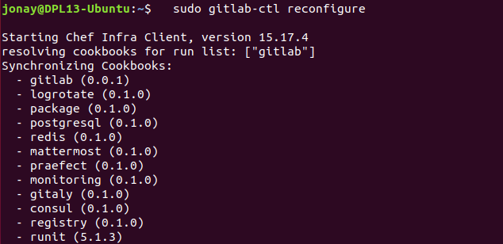
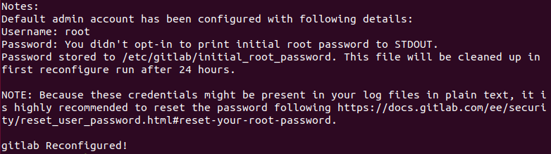
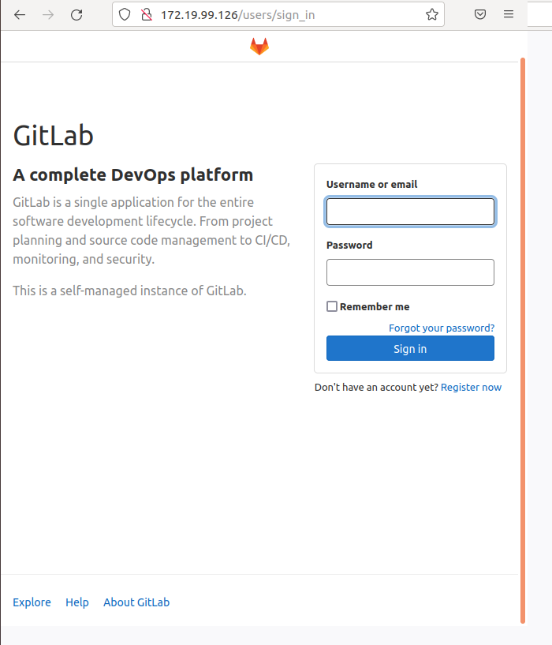
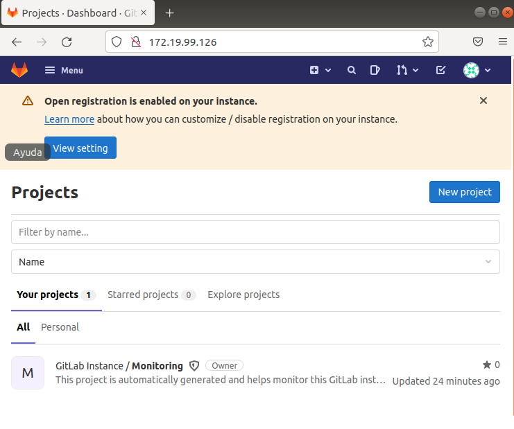

# 1. Instalación de GitLab.
Vamos a realizar la instalación de GitLab, así como su configurador. En este ejemplo se usara una maquina Ubuntu 20.

## 1.1 Actualizar.
Primero vamos a actualizar tanto las librerías como el sistema para esto vamos a usar el siguiente comando.
```
 -> sudo apt update && sudo apt upgrade
```



1.2 Instalación paquetes.
Vamos a instalar una serie de paquete necesarios para instalar GitLab en nuestro sistema, para esto realizamos el comando en nuestra maquina.
```
 ->   sudo apt install -y vim curl ca-certificates apt-transport-https
```



1.3 Instalar GitLab.
Primer para instalar GitLab realizamos un curl como el siguiente:
```
 -> curl -s https://packages.gitlab.com/install/repositories/gitlab/gitlab-ce/script.deb.sh | sudo bash
```



y ahora si realizamos la instalación .
```
 ->  sudo apt install gitlab-ce
```




Comprobamos que al final nos muestro lo siguiente para asegurarnos de que se ha instado.



Con GitLab instalado deberemos realizar el siguiente comando para dejar configurado la herramienta.
```
 ->  sudo gitlab-ctl reconfigure
```




Y al final veremos algo como esto.



1.4 Acceso.
Ahora ya tenemos instalado el GitLab vamos a acceder por medio de la ip.ip a




Ahora para acceder deberemos poner el usuario “root” y la contraseña que se encuentra en la carpeta que te avisa al terminar la configuración. En este caso estaba en “/etc/gitlab/initial_root_password”.

